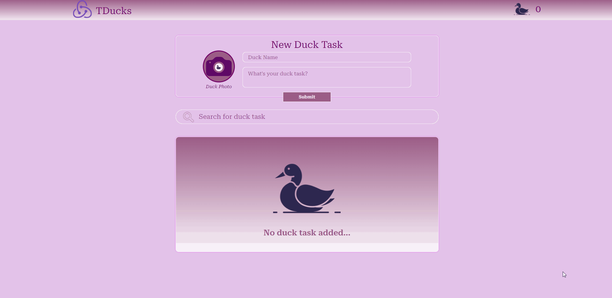

# ToDucks 💭

Repositório do projeto **ToDucks** desenvolvido para aprofundar os conhecimentos em Redux, Redux-Persist na arquitetura Flux e aplicar escalabilidade com o Duck Pattern

### 🎯 Menu

Clique para expandir

◽ <a href="#inicio">Início</a>  
◽ <a href="#instalacao">Acessar Projeto</a>  
◽ <a href="#acessar-projeto">Instalação</a>  
◽ <a href="#tecnologias">Tecnologias</a>  
◽ <a href="#sobre">Sobre</a>  
◽ <a href="#extras">Extras</a>  
◽ <a href="#preview">Preview</a>  
◽ <a href="#status">Status do Projeto</a>  
◽ <a href="#autor">Autor</a>  

<h3 id="preview">🎥 Preview</h3>

<h3 id="inicio">🚀 Site do projeto</h3>

[Visite o Site do Projeto MoviesApp]() 🎮

<h3 id="acessar-projeto">📁 Inicialização da Clonagem</h3>

◽ <a href="">Acessar</a>🔗 o código fonte pelo GitHub.  
◽ Clonar o repositório ultilizando Git Bash + o comando:

       $ git clone https://github.com/IMatheusPiresI/to-ducks-tasks.git

◽ Acessar a pasta to-ducks-tasks e executar o comando  

        $ yarn

◽ Após a instalação das dependências, rodar o comando   

        $ yarn dev

<h3 id="instalacao">🛠️ Acessar Projeto</h3>

Ao clicar em <a href="" target="_blank">ToDucks</a>🔗 o site irá abrir para que possa utilizá-lo. Ele salvará as informações de seus tasks em localstorage graças ao redux-persist, é possível criar, excluir, editar e saber quantas tasks você criou, isso é feito através do gerenciamento de estados globais com Redux;

<h3 id="tecnologias">⚙️ Tecnologias Utilizadas</h3>

  
  
  

<h3 id="sobre">📍 Sobre</h3>

✅ Desenvolvido com React, Styled-Components, Redux, Redux-Persist, Duck Pattern, React Hooks.  
✅ Dados de tasks criadas são salvadas em localStorage pelo redux-persist.  
✅ Possível pesquisar pelas suas tasks e filtrar pelo nome e descrição da task. 
✅ Responsividade pensando no conceito de Mobile First.   

<h3 id="status">📌 Status do projeto</h3>

Finalizado e recebendo feedbacks. ✔

<h3 id="autor">✒️ Autor</h3>

[Clique aqui](https://matheuspires.vercel.app)🔗 e acesse meu portfólio!  
Desenvolvido com ❤️ por **Matheus Pires** © Alguns direitos reservados.

  
# to-ducks-tasks
Tecnologias: React, Vite, React-Hooks, Redux com Arquitetura Flux, Redux-Persist para guardar os dados das tasks e Duck Pattern para organização do Redux;
